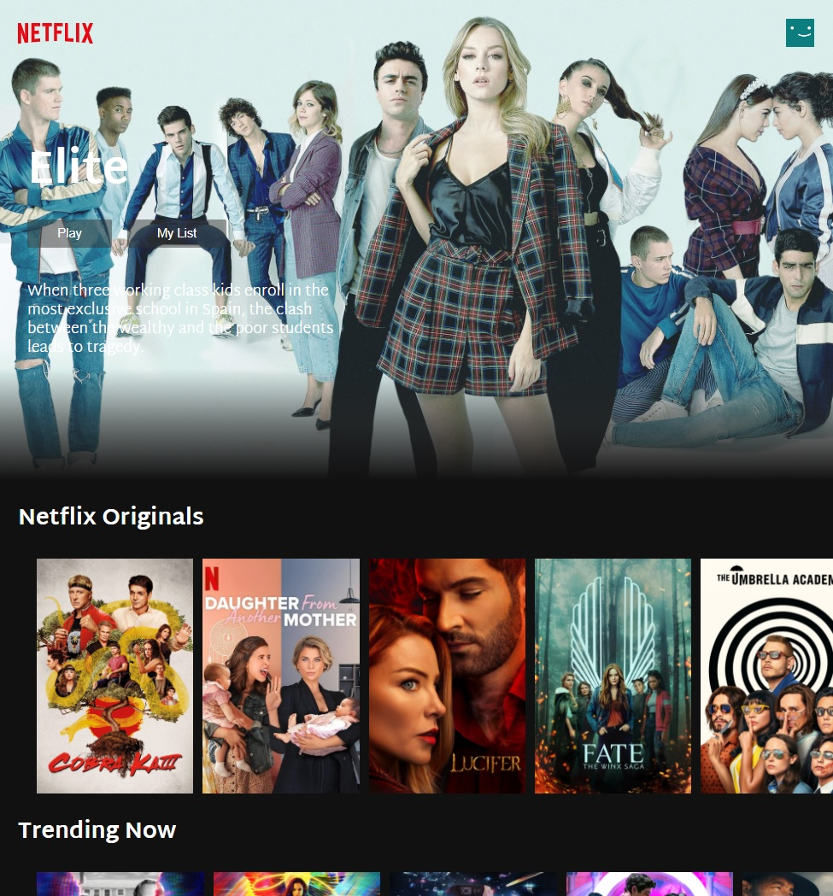

# Netflix Clone




Code along tutorial teaching React, Hooks, API for creating Netflix clone - page.

It uses [The MovieDB Api](https://www.themoviedb.org/documentation/api)

### Tools used:
- TMDB API
- Axios
- .env
- YouTube npm
- movieTrailer npm (not working)


## 🚀 Technologies:


- ✔ JavaScript
- ✔ ReactJs
- ✔ useEffect
- ✔ useState
- ✔ CSS
- ✔ HTML

## Available Scripts

In the project directory, you can run:

<h4> Clone this repository </h4>

```
 $ git clone https://github.com/Munkiestar/netflix-clone--react
```

### `npm install`
### `npm start`

Runs the app in the development mode.\
Open [http://localhost:3000](http://localhost:3000) to view it in the browser.

